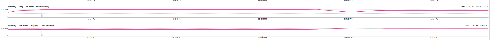
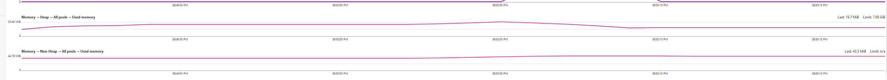

# Findings

`700` consecutive requests from Postman using [YourKit](https://www.yourkit.com/) Profiler and logging.

Static helpers are definitely better. Use `Beans`` sparingly (of course).

## Components

Using `@Component`` based helpers only: 

`2023-10-07T20:42:21.051-05:00  INFO 1692 --- [nio-8080-exec-8] i.t.s.helpers.ExampleComponentHelper     : heapSize: 71303168 heapMaxSize: 8573157376 heapFreeSize: 40954384`

[](Components.png)

## Static Helpers

Using `Static` helpers only: 

`2023-10-07T20:50:07.373-05:00  INFO 21104 --- [nio-8080-exec-5] i.t.s.helpers.ExampleStaticHelper        : heapSize: 79691776 heapMaxSize: 8573157376 heapFreeSize: 56225664`

[](Static.png)

## Combined

Curious about the influence of GC - some possible advantages due to how `Bean`'s are loaded.

```
2023-10-07T20:54:11.711-05:00  INFO 17800 --- [nio-8080-exec-1] o.s.web.servlet.DispatcherServlet        : Completed initialization in 0 ms
2023-10-07T20:54:11.726-05:00  INFO 17800 --- [nio-8080-exec-1] i.t.springexps.helpers.JvmHeapHelper     : heapSize: 75497472 heapMaxSize: 8573157376 heapFreeSize: 58207856
2023-10-07T20:54:11.727-05:00  INFO 17800 --- [nio-8080-exec-1] i.t.springexps.helpers.JvmHeapHelper     : Garbage collecting...
2023-10-07T20:54:11.756-05:00  INFO 17800 --- [nio-8080-exec-1] i.t.springexps.helpers.JvmHeapHelper     : Sleeping for 5s...
2023-10-07T20:54:16.761-05:00  INFO 17800 --- [nio-8080-exec-1] i.t.s.helpers.ExampleStaticHelper        : testStaticHelper
2023-10-07T20:54:16.762-05:00  INFO 17800 --- [nio-8080-exec-1] i.t.s.helpers.ExampleStaticHelper        : Time taken 1
2023-10-07T20:54:16.762-05:00  INFO 17800 --- [nio-8080-exec-1] i.t.springexps.helpers.JvmHeapHelper     : heapSize: 58720256 heapMaxSize: 8573157376 heapFreeSize: 45785128
2023-10-07T20:54:16.762-05:00  INFO 17800 --- [nio-8080-exec-1] i.t.springexps.helpers.JvmHeapHelper     : Garbage collecting...
2023-10-07T20:54:16.789-05:00  INFO 17800 --- [nio-8080-exec-1] i.t.springexps.helpers.JvmHeapHelper     : Sleeping for 5s...
2023-10-07T20:54:21.802-05:00  INFO 17800 --- [nio-8080-exec-1] i.t.s.helpers.ExampleComponentHelper     : testComponentHelper
2023-10-07T20:54:21.802-05:00  INFO 17800 --- [nio-8080-exec-1] i.t.s.helpers.ExampleComponentHelper     : Time taken 0
2023-10-07T20:54:21.802-05:00  INFO 17800 --- [nio-8080-exec-1] i.t.springexps.helpers.JvmHeapHelper     : heapSize: 41943040 heapMaxSize: 8573157376 heapFreeSize: 30602968
2023-10-07T20:54:21.802-05:00  INFO 17800 --- [nio-8080-exec-1] i.t.springexps.helpers.JvmHeapHelper     : Garbage collecting...
2023-10-07T20:54:21.822-05:00  INFO 17800 --- [nio-8080-exec-1] i.t.springexps.helpers.JvmHeapHelper     : Sleeping for 5s...
2023-10-07T20:54:33.599-05:00  INFO 17800 --- [nio-8080-exec-4] i.t.springexps.helpers.JvmHeapHelper     : heapSize: 41943040 heapMaxSize: 8573157376 heapFreeSize: 26816176
2023-10-07T20:54:33.600-05:00  INFO 17800 --- [nio-8080-exec-4] i.t.springexps.helpers.JvmHeapHelper     : Garbage collecting...
2023-10-07T20:54:33.621-05:00  INFO 17800 --- [nio-8080-exec-4] i.t.springexps.helpers.JvmHeapHelper     : Sleeping for 5s...
2023-10-07T20:54:38.627-05:00  INFO 17800 --- [nio-8080-exec-4] i.t.s.helpers.ExampleStaticHelper        : testStaticHelper
2023-10-07T20:54:38.627-05:00  INFO 17800 --- [nio-8080-exec-4] i.t.s.helpers.ExampleStaticHelper        : Time taken 0
2023-10-07T20:54:38.627-05:00  INFO 17800 --- [nio-8080-exec-4] i.t.springexps.helpers.JvmHeapHelper     : heapSize: 41943040 heapMaxSize: 8573157376 heapFreeSize: 30240928
2023-10-07T20:54:38.627-05:00  INFO 17800 --- [nio-8080-exec-4] i.t.springexps.helpers.JvmHeapHelper     : Garbage collecting...
2023-10-07T20:54:38.648-05:00  INFO 17800 --- [nio-8080-exec-4] i.t.springexps.helpers.JvmHeapHelper     : Sleeping for 5s...
2023-10-07T20:54:43.651-05:00  INFO 17800 --- [nio-8080-exec-4] i.t.s.helpers.ExampleComponentHelper     : testComponentHelper
2023-10-07T20:54:43.651-05:00  INFO 17800 --- [nio-8080-exec-4] i.t.s.helpers.ExampleComponentHelper     : Time taken 0
2023-10-07T20:54:43.651-05:00  INFO 17800 --- [nio-8080-exec-4] i.t.springexps.helpers.JvmHeapHelper     : heapSize: 41943040 heapMaxSize: 8573157376 heapFreeSize: 30242296
2023-10-07T20:54:43.651-05:00  INFO 17800 --- [nio-8080-exec-4] i.t.springexps.helpers.JvmHeapHelper     : Garbage collecting...
2023-10-07T20:54:43.673-05:00  INFO 17800 --- [nio-8080-exec-4] i.t.springexps.helpers.JvmHeapHelper     : Sleeping for 5s...

```